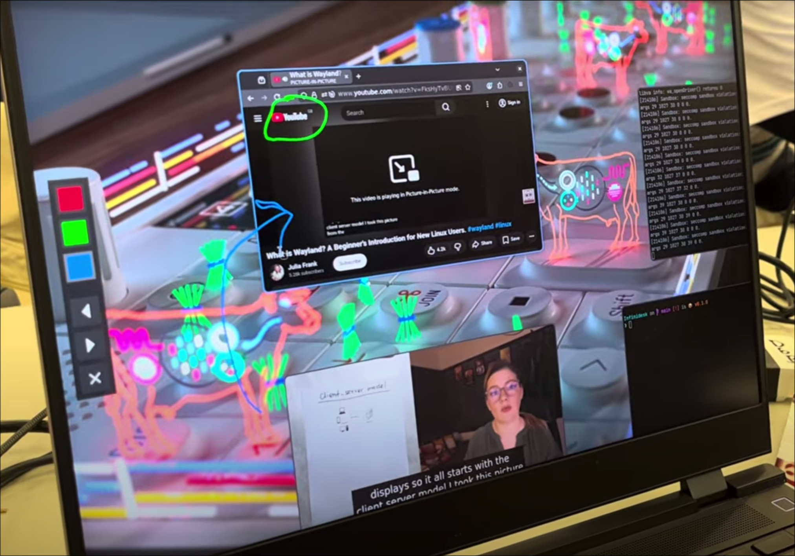

# Infinidesk

An infinite spatial canvas, for your desktop.



## Why Infinidesk?

The modern PC desktop can feel **claustrophobic** - creative and developer workflows frequently demand access to many apps and tabs at once, resulting in a frantic mess of alt-tabbing through piles of overlapping panes. The position and order of your windows **keeps changing** - which is difficult to keep track of and creates friction in your workflow. This problem is especially bad on the confines of a laptop screen, where screen space is particularly scarce.

Infinidesk is a new, **spatially-oriented** way to navigate your desktop. Drawing inspiration from digital whiteboard apps, windows are positioned on an **infinite canvas**, breaking the bounds of your screen borders. This takes advantage of our intuitive spatial awareness instead of fighting it, well-proven as the [most popular digital note-taking method](https://reports.valuates.com/market-reports/QYRE-Auto-10U1842/global-note-taking-app).

## Key features

- **Wayland-native:** Supports the latest and greatest apps right out of the box.
- **Touchpad gesture support:** Zoom across the canvas with 2-finger pan!
- **Fast navigation:** Use alt+tab to rapidly warp between windows.
- **Freeform zoom:** Zoom in to fine app details, or out to show more windows!
- **Shell layering:** Run a wallpaper daemon on the bottom layer, or render a taskbar over the top.
- **Built-in annotations:** Draw and markup in and around your windows with a built-in pen tool!

## Implementation

Infinidesk is written in pure C, making use of the [wlroots](https://gitlab.freedesktop.org/wlroots/wlroots) Wayland compositor library/framework for the really low-level stuff (damage tracking, user input registration, low-level graphics).

Wayland clients (apps) can attempt to call a range of different protocol functions for different functionality (e.g. layering, or input device capture). A range of different protocols were implemented, with `src/layer_shell.c` being a good example of an implementation of the `wlr-layer-shell-unstable-v1` protocol.

The [PangoCairo](https://docs.gtk.org/PangoCairo/pango_cairo.html) text rendering library is used for rendering fonts in e.g. the alt-tab switcher.

Claude 4.5 Opus was used via OpenCode and Claude Code for scaffolding and debugging the project.

## Building and running

To ensure deterministic and reliable builds, a [Nix](https://nixos.org/) flake is used to build and run Infinidesk. Nix is also the **easiest way** to build and run this project.

To build Infinidesk:

```shell
nix build
# Executable in ./result/bin/infinidesk
```

To directly run:

```shell
nix run
```
